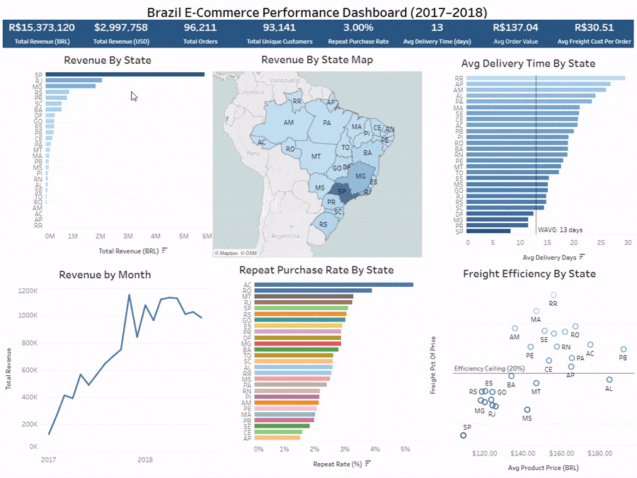
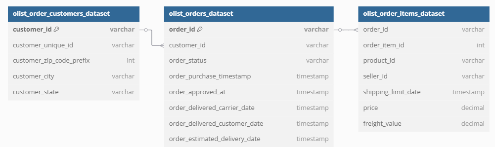

# Brazil E-Commerce Performance Dashboard (2017–2018)

This project analyzes Brazil's e-commerce activity using public data from the Olist marketplace. The goal was to uncover insights into customer behavior, revenue performance, logistics trends, and repeat purchasing. This project uses SQL and Tableau to replicate the workflow of a real-world business intelligence process.

📊 **Interactive Tableau Dashboard**: [View Live Dashboard](https://public.tableau.com/views/OlistEcommerceDataProject/BrazilE-CommercePerformanceDashboard20172018?:language=en-US&:sid=&:redirect=auth&:display_count=n&:origin=viz_share_link)

[](https://public.tableau.com/views/OlistEcommerceDataProject/BrazilE-CommercePerformanceDashboard20172018?:language=en-US&:sid=&:redirect=auth&:display_count=n&:origin=viz_share_link)
## 🧠 Executive Summary

- São Paulo accounts for approximately 37% of total revenue and has the most efficient logistics with the lowest freight percentage.
- Just 3% of customers make repeat purchases, highlighting a potential retention issue despite fast delivery.
- The weighted average delivery time is 13 days, consistently faster than the estimated delivery window.
- Freight costs in remote states like Roraima (RR) average 27.8% of product value, exceeding the 20% threshold used to identify logistical concerns.

## 🗂️ Folder Structure

```
Olist_Ecommerce_Data_project/
├─ project_data/       # Raw data files from Kaggle
├─ sql_queries/        # All SQL queries used for analysis
├─ sql_results/        # CSV outputs used to build Tableau visuals
├─ assets/             # Dashboard screenshots and diagrams
└─ README.md
```

## 📦 Data Source

The Olist dataset is available on [Kaggle](https://www.kaggle.com/datasets/olistbr/brazilian-ecommerce). It includes customer, order, and item-level data. This project focuses on the core commerce tables only. Below is an Entity Relationship Diagram for the 3 tables used in this project:



## 💻 Tools Used

- **PostgreSQL** (via VS Code): Wrote and ran SQL queries for all calculations.
- **Tableau Public**: Built the dashboard with calculated fields, maps, and KPIs.

## 🧮 Key Questions & Analysis

### 📈 1. How Have Monthly Sales Changed Over Time?


- Visualized monthly revenue by state from 2017–2018 using a line chart.
- Identified clear seasonality with revenue peaking in November and December, likely due to holiday shopping (Black Friday and Christmas).
- A noticeable dip in early 2018 suggests either post-holiday slowdowns or broader demand shifts.
- Filtering by state reveals that while São Paulo (SP) consistently drives the largest share of revenue, seasonal patterns are echoed across other top-performing states, suggesting nationwide consumer trends.


[🧾 View SQL Query](sql_queries/monthly_revenue_2017-2018.sql)  
[📄 View CSV Output](sql_results/monthly_revenue_2017_2018.csv)

### 🗺️ 2. Which States Generate the Most Revenue?


- Created a bar chart and a Brazil map to visualize state-level revenue, with BRL as the base currency and USD conversions added to tooltips for context.
- **São Paulo (SP)** clearly leads with the highest total revenue, reflecting its economic dominance and dense customer base.
- The next highest states are **Rio de Janeiro (RJ)** and **Minas Gerais (MG)**, though both generate significantly less revenue than SP.
- This highlights the importance of SP as a core market and suggests that scaling efforts in RJ and MG could yield strong returns due to their already high baseline activity.
- This state-level view enables quick comparison and helps prioritize regions for marketing, logistics, or customer retention strategies.

[🧾 View SQL Query](sql_queries/revenue_by_state.sql)  
[📄 View CSV Output](sql_results/revenue_by_state.csv)

### 🔁 3. What Percent of Our Customers Are Repeat Buyers?

- Calculated the percentage of customers who placed more than one order, broken down by state.
- Found that only ~3% of customers made repeat purchases.
- *Note: The dataset covers a limited window (Jan 2017–Aug 2018), which may underestimate long-term retention.*

[🧾 View SQL Query](sql_queries/repeat_rate_by_state.sql)  
[📄 View CSV Output](sql_results/repeat_rate_by_state.csv)

### ⏱️ 4. What’s the Average Delivery Time, and Are We Meeting Delivery Expectations?

- Measured the average number of days from purchase to delivery for each state.
- Compared actual delivery times to the estimated delivery dates provided with each order.
- Results show that **every state had an average delivery time earlier than expected**, meaning the company consistently exceeded delivery expectations.
- For example, states like São Paulo (SP) had the fastest delivery times (~9 days), while remote regions like Roraima (RR) averaged closer to 30 days, yet still beat the estimated delivery date by over 15 days.
- Detailed comparisons are visible via tooltips on the dashboard’s bar chart.

[🧾 View SQL Query](sql_queries/delivery_time_by_state.sql)  
[📄 View CSV Output](sql_results/delivery_by_state.csv)

### 🚚 5. Are There Any Red Flags in Freight Costs or Product Pricing Trends?

- Built a scatterplot comparing average product price and average freight cost by state.
- Calculated freight as a percentage of product price to normalize for pricing differences across regions.
- Introduced a visual **efficiency ceiling at 20%**, meaning any state with freight costs regularly exceeding 20% of product price is flagged as potentially inefficient.
- This threshold helps quickly identify regions where logistics may be eroding margins or affecting customer satisfaction.
- For example, remote states like Roraima (RR) and Acre (AC) exceed the threshold, reflecting high delivery challenges, while São Paulo (SP) and Rio de Janeiro (RJ) fall well below it due to urban density and infrastructure.
- This approach enables stakeholders to **spot outliers instantly** and prioritize deeper investigation or logistics cost optimization in high-cost regions.

[🧾 View SQL Query](sql_queries/freight_vs_price_by_state.sql)  
[📄 View CSV Output](sql_results/freight_vs_price_by_state.csv)

### 🎯 6. Are We Hitting Our Core Performance Targets?


- **Total Revenue and Orders** confirm strong marketplace activity with nearly 100,000 fulfilled orders.
- **Unique Customers** show wide market reach, while a low **Repeat Purchase Rate (~3%)** points to a potential growth opportunity in retention or loyalty programs.
- **Weighted Avg Delivery Time (~13 days)** is well below the estimated delivery window across all states, indicating strong logistics execution.
- **Avg Order Value** and **Avg Freight Cost Per Order** help gauge margins and efficiency. When combined with the freight scatterplot, these KPIs highlight cost challenges in more remote regions.

## 💡 Conclusion & Key Takeaways

This project revealed how regional differences in Brazil impact e-commerce performance, from freight costs to delivery times to repeat purchase behavior. São Paulo consistently led in both revenue and logistics efficiency, while more remote states like Roraima exposed the challenges of costly fulfillment. Despite strong delivery performance overall, the low repeat purchase rate highlights a missed opportunity in customer retention. By surfacing these patterns through SQL and Tableau, this project shows how data can guide decisions on where to improve margins, reallocate marketing efforts, and tailor operations by geography.


## ⚠️ Caveats & Limitations

- **Freight Cost Interpretation**: Freight data is broken down by order and state but not by package weight or delivery distance. For example, Roraima (RR) shows high average freight % due to its remote location, unlike São Paulo (SP), which benefits from better infrastructure.
- **Marketplace-Specific**: This dataset only covers the Olist platform and may not reflect behavior on other marketplaces.
- **Static Aggregations**: Tableau visuals rely on pre-aggregated SQL output. Averages are weighted in SQL when needed, but dynamic filtering is limited.

## 🔧 Challenges & Lessons Learned

- Learned how to identify performance benchmarks like freight efficiency ceilings and apply them to uncover hidden cost issues.
- Balanced technical accuracy (e.g., weighted averages, freight normalization) with dashboard clarity and usability.
- Refined the scope of analysis by removing low-impact visuals, improving storytelling and focus.
- Practiced aligning visual design with user intuition, for example, using map color gradients to highlight state performance.
- Developed a repeatable project structure with organized queries, clean outputs, and documented insights for every chart.


## 🧭 Opportunities for Further Exploration  
This project focused on core commerce tables but left several areas unexplored. Future analysis could include:

- **Product Category Trends**: Analyze sales, reviews, and returns by category to optimize inventory or marketing.
- **Customer Reviews**: Correlate review scores with delivery time, product pricing, or freight costs.
- **Payment Behavior**: Explore payment methods and installment patterns to inform financial strategy.
- **Geographic Logistics**: Use geolocation data to study delivery routes, regional delivery time, and cost variability.
- **Seller Performance**: Evaluate metrics like fulfillment speed, customer satisfaction, and return rates across sellers.

## ✍️ Author

**James Gifford**  
Data Analyst  
[LinkedIn](https://www.linkedin.com/in/jamesgifford5/) • [Tableau Public](https://public.tableau.com/app/profile/james.gifford/vizzes)
