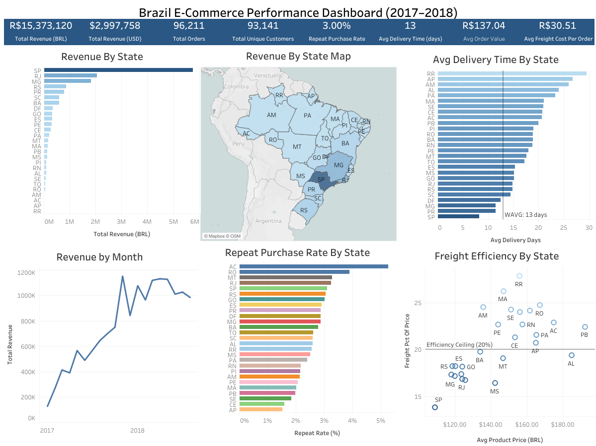

# Olist Brazil E-Commerce Dashboard (2017–2018)

📊 **Interactive Tableau Dashboard**: [View Live Dashboard](https://public.tableau.com/app/profile/james.gifford/viz/OlistEcommerceDataProject/OlistBrazilE-CommerceData20172018?publish=yes)

[](https://public.tableau.com/app/profile/james.gifford/viz/OlistEcommerceDataProject/OlistBrazilE-CommerceData20172018?publish=yes)

## 🔍 Overview
This project analyzes Brazil's e-commerce landscape using the public Olist dataset. I focused on customer behavior, revenue patterns, logistics efficiency, and repeat purchase trends to uncover insights from nearly 100,000 orders. The project was also a way for me to practice SQL, data cleaning, and building professional dashboards in Tableau.

## 📦 Data Source

The Olist dataset is available on [Kaggle](https://www.kaggle.com/datasets/olistbr/brazilian-ecommerce) with a 10/10 quality rating. While it includes many tables, this project focuses on just three: customer, order, and item-level data from a major Brazilian e-commerce marketplace.  


## 💻 Tools Used

- **PostgreSQL (in VS Code)**: Used to write and run SQL queries for analysis.
- **Tableau Public**: Built the final dashboard with calculated fields, maps, tooltips, and KPI cards.  

## 🧮 Key Questions & Analysis

### 1. Monthly Revenue Trend
> **How have monthly sales and order volume changed over time?**
- Visualized monthly revenue by state from 2017–2018.
- Identified strong seasonality with peaks during holiday months.
```sql
SELECT 
  DATE_TRUNC('month', o.order_purchase_timestamp)::date AS order_month,
  c.customer_state,
  COUNT(DISTINCT o.order_id) AS total_orders,
  SUM(oi.price + oi.freight_value) AS total_revenue
FROM orders o
JOIN order_items oi ON o.order_id = oi.order_id
JOIN customers c ON o.customer_id = c.customer_id
WHERE o.order_status = 'delivered'
  AND o.order_purchase_timestamp >= '2017-01-01'
GROUP BY 1, 2
ORDER BY 1, 2;
```
[📄 View CSV Output](sql_results_csv\monthly_revenue_2017_2018.csv)


### 2. Revenue by State
> **Which Brazilian states generate the most revenue?**
- Created both a bar chart and a gradient-filled map of revenue by Brazilian state.
- Used BRL and USD in tooltips.
```sql
SELECT 
  c.customer_state,
  COUNT(DISTINCT o.order_id) AS total_orders,
  ROUND(SUM(oi.price + oi.freight_value), 2) AS total_revenue
FROM orders o
JOIN customers c ON o.customer_id = c.customer_id
JOIN order_items oi ON o.order_id = oi.order_id
WHERE o.order_status = 'delivered'
  AND o.order_purchase_timestamp >= '2017-01-01'
GROUP BY c.customer_state
ORDER BY total_revenue DESC;
```
[📄 View CSV Output](sql_results_csv\revenue_by_state.csv)


### 3. Repeat Purchase Rate by State
> **How many customers are making repeat purchases?**
- Calculated % of customers who placed more than one order.
- Compared state-level loyalty trends using a horizontal bar chart.
```sql
SELECT 
  sub.customer_state,
  COUNT(DISTINCT CASE WHEN sub.order_count = 1 THEN sub.customer_unique_id END) AS one_time,
  COUNT(DISTINCT CASE WHEN sub.order_count > 1 THEN sub.customer_unique_id END) AS repeat,
  COUNT(DISTINCT sub.customer_unique_id) AS total_customers,
  ROUND(100.0 * COUNT(DISTINCT CASE WHEN sub.order_count > 1 THEN sub.customer_unique_id END) /
        COUNT(DISTINCT sub.customer_unique_id), 2) AS repeat_rate_pct
FROM (
  SELECT 
    c.customer_unique_id, 
    c.customer_state, 
    COUNT(o.order_id) AS order_count
  FROM orders o
  JOIN customers c ON o.customer_id = c.customer_id
  WHERE o.order_status = 'delivered'
    AND o.order_purchase_timestamp >= '2017-01-01'
  GROUP BY c.customer_unique_id, c.customer_state
) sub
GROUP BY sub.customer_state
ORDER BY repeat_rate_pct DESC;
```
[📄 View CSV Output](sql_results_csv\repeat_rate_by_state.csv)


### 4. Delivery Time by State
> ***What’s the average delivery time, and are we meeting delivery expectations?**
- Analyzed average delivery time (in days) per state.
- Added average lines and gradient formatting to identify delays.
```sql
SELECT 
  c.customer_state,
  COUNT(o.order_id) AS delivered_orders,
  ROUND(AVG(EXTRACT(DAY FROM o.order_delivered_customer_date - o.order_purchase_timestamp)), 2) AS avg_delivery_days,
  ROUND(AVG(EXTRACT(DAY FROM o.order_estimated_delivery_date - o.order_delivered_customer_date)), 2) AS avg_days_early_or_late
FROM orders o
JOIN customers c ON o.customer_id = c.customer_id
WHERE o.order_status = 'delivered'
  AND o.order_purchase_timestamp >= '2017-01-01'
  AND o.order_delivered_customer_date IS NOT NULL
GROUP BY c.customer_state
ORDER BY avg_delivery_days DESC;
```
[📄 View CSV Output](sql_results_csv\delivery_by_state.csv)


### 5. Freight Cost vs Product Price
> **Are there any red flags in freight costs or order size trends?**
- Built a scatterplot showing the relationship between product price and freight cost per state.
- Added an efficiency ceiling to call out states where freight cost is over 20% of the average product price. 
```sql
SELECT 
  c.customer_state,
  ROUND(AVG(oi.price), 2) AS avg_product_price,
  ROUND(AVG(oi.freight_value), 2) AS avg_freight_cost,
  ROUND(AVG(oi.freight_value) / NULLIF(AVG(oi.price), 0) * 100, 2) AS freight_pct_of_price
FROM orders o
JOIN customers c ON o.customer_id = c.customer_id
JOIN order_items oi ON o.order_id = oi.order_id
WHERE o.order_status = 'delivered'
  AND o.order_purchase_timestamp >= '2017-01-01'
GROUP BY c.customer_state
ORDER BY freight_pct_of_price DESC;
```
[📄 View CSV Output](sql_results_csv\freight_vs_price_by_state.csv)


### 6. One-Time vs Repeat Customers
> **What percent of our customers are repeat buyers?**
- Pie chart showing customer breakdown: ~97% one-time, ~3% repeat.
```sql
SELECT 
  CASE 
    WHEN order_count = 1 THEN 'One-Time'
    ELSE 'Repeat'
  END AS customer_type,
  COUNT(*) AS customer_count
FROM (
  SELECT c.customer_unique_id, COUNT(DISTINCT o.order_id) AS order_count
  FROM orders o
  JOIN customers c ON o.customer_id = c.customer_id
  WHERE o.order_status = 'delivered'
    AND o.order_purchase_timestamp >= '2017-01-01'
  GROUP BY c.customer_unique_id
) sub
GROUP BY customer_type;
```
[📄 View CSV Output](sql_results_csv\repeat_vs_onetime.csv)


### 7. KPI Banner

A high-level summary of key business metrics to quickly assess marketplace performance:

- Total Revenue (BRL & USD)
- Total Orders
- Total Unique Customers
- Repeat Purchase Rate (%)
- Avg Delivery Time (days)
- Avg Freight Cost Per Order

## 🔧 Challenges & Lessons Learned

- Learned how to structure a SQL-to-Tableau pipeline using intermediate CSV outputs.
- Worked through PostgreSQL table imports, relationships, and joins.
- Created custom calculated fields for tooltips and currency conversion.
- Designed layout containers in Tableau for a clean, mobile-responsive dashboard.


## ✍️ Author
**James Gifford**  
Data Analyst  
[LinkedIn](https://www.linkedin.com/in/jamesgifford5/) • [Tableau Public](https://public.tableau.com/app/profile/james.gifford/vizzes)
